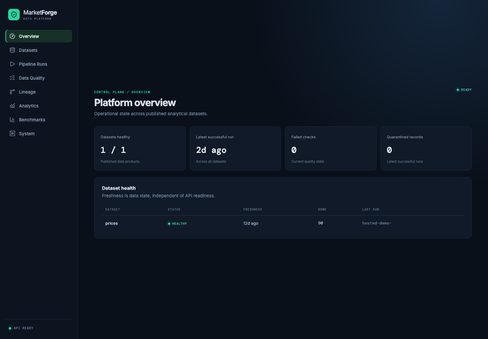
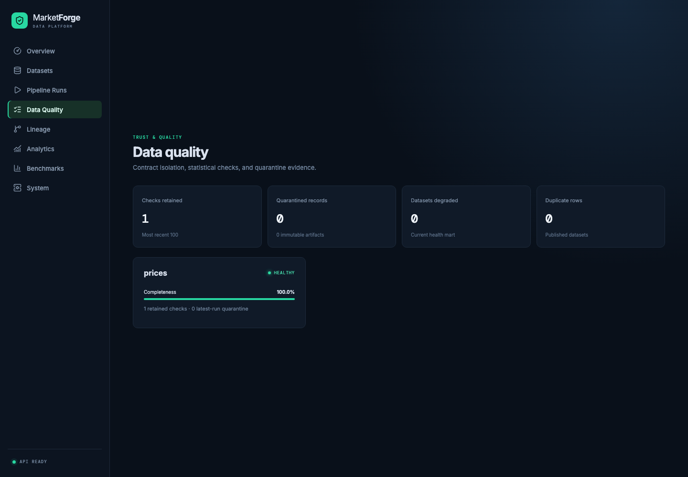
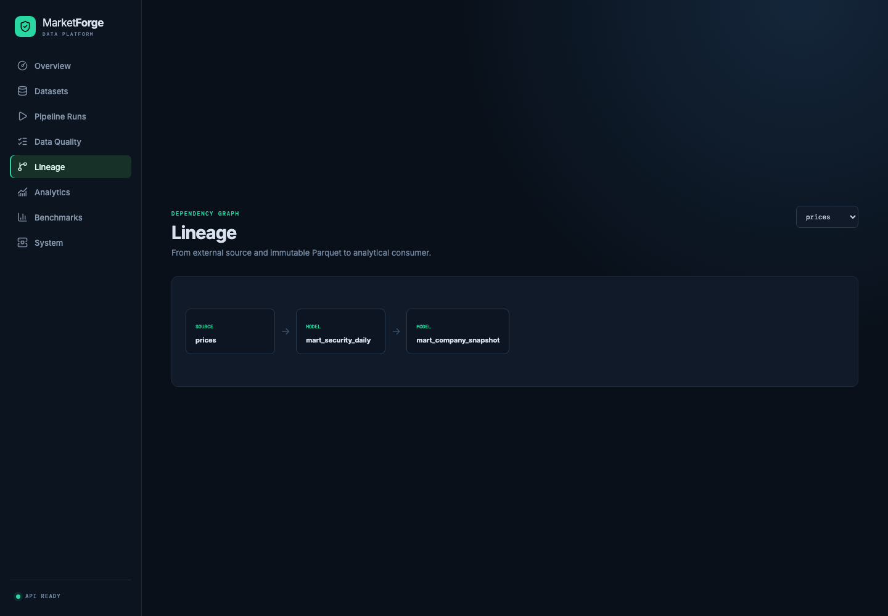

# MarketForge

## Local-First Analytical Data Platform

> A CPU-only data platform demonstrating production analytical-engineering
> patterns—incremental ingestion, Parquet storage, DuckDB analytics, dbt lineage,
> orchestration, data contracts, backfills, failure recovery, and
> observability—without pretending a laptop is a distributed cluster.

MarketForge is a systems project, not a stock-prediction application. It asks how
much of a reliable analytical platform can be implemented and measured on one
laptop: immutable raw inputs, checkpointed increments, explicit contracts,
quarantine, reproducible builds, point-in-time-aware transformations, lineage,
quality gates, recovery drills, and bounded serving APIs.

**[Open the live MarketForge dashboard](https://marketforge-flame.vercel.app/)**

The public dashboard is a read-only control plane backed by a bounded snapshot
materialized from live Tiingo, SEC EDGAR, Business Quant, FRED, and NewsAPI
requests during each Render deployment. It is a demonstration surface, not the
full local lake or a continuously streaming system.

## Architecture

```text
External Sources
  Tiingo / SEC / Business Quant / FRED / NewsAPI
              / files / optional StreamAlpha
              │
              ▼
    Incremental Ingestion ────────┐
              │                   │
              ▼                   │
    Contracts / Quarantine        │
              │                   │
              ▼                   │
 Partitioned immutable Parquet    │
              │                   │
              ▼                   │
            DuckDB                │
              │                   │
              ▼                   │
              dbt                 │
              │                   │
              ▼                   │
      Analytical Marts            │
              │                   │
              ▼                   │
           FastAPI                │
              │                   │
              ▼                   │
            React                 │
                                  │
                 Dagster ◄────────┘
                    ↕
          metadata / lineage / health
```

The raw lake remains Parquet. DuckDB reads it directly, while dbt persists only
consumer-facing marts. Dagster expresses asset dependencies and retries; SQLite
stores transactional operational metadata. FastAPI exposes allowlisted reads, and
the React application is a data-platform control plane rather than the system of
record.

The construction sequence and phase gates are recorded in the
[`implementation-order audit`](docs/implementation_order.md).

## Why local-first?

The reference machine is a 14-core Apple M4 Pro MacBook Pro with 48 GB RAM, but
all project workloads are CPU-only. At baseline the volume had roughly 29 GiB
free and was already 94% utilized, so disk—not fictional cluster scale—is the
useful engineering constraint.

| Budget | Limit |
| --- | ---: |
| Total project storage | 12 GB |
| Raw data | 5 GB |
| Transformed data | 3 GB |
| Docker | 3 GB |
| Daily incremental runtime | 300 s |
| Daily incremental peak RAM | 4,096 MB |
| Minimum free-disk reserve | 5 GB |

Distributed execution is unnecessary for 140,703 daily price rows. Spark,
Kubernetes, and managed metadata services would add operational surface without a
measured benefit. The explicit budget and guardrails live in
[`config/resource_budget.yaml`](config/resource_budget.yaml).

## Data and provenance

| Domain | Provider / coverage | Range and cadence | Limitations and usage |
| --- | --- | --- | --- |
| Daily prices | Tiingo; 140,700 real rows, 100 U.S. symbols | 2021-01-04–2026-08-11; market days after close | Raw, unadjusted OHLCV. Corporate actions and adjusted prices are not modeled. Internal use under the account's Tiingo terms; raw data is Git-ignored and not redistributed. |
| Synthetic prices | Included three-row smoke fixture | 2025-01-02–2025-03-03; manual | Not market data and excluded from Tiingo refresh comparisons. |
| StreamAlpha anomalies | Optional public HTTP snapshot/Kafka adapter; 500 retained events, 15 symbols | 2026-08-04–2026-08-11 in the current local lake | HTTP endpoint has a bounded limit and no cursor, so polling is replay-safe but not gap-free. Kafka is required for continuous-delivery guarantees. |
| Fundamentals | SEC EDGAR; 841 selected Apple filing facts | 10-K/10-Q filing semantics | Public company facts retain accession and `filed_at`; current bounded load covers one company and selected GAAP metrics. |
| Earnings | Business Quant; 25 Apple quarterly EPS observations | Historical and forward estimate snapshots | Endpoint lacks announcement timestamps, so observation time is retained and is not presented as release time. |
| Macro | FRED; 1,622 observations across five core series | Daily, monthly, and quarterly observations | Observation endpoint lacks vintage release timestamps; `released_at` remains null rather than being invented. |
| News | NewsAPI; 25 current metadata records | Bounded metadata batches | Headline, URL, publisher, and timestamp only; licensing governs use and no article bodies are retained. |

The three-row difference between the total 140,703-row price lake and the 140,700
Tiingo rows is the checked smoke fixture. The hosted demo is a separate bounded
live-provider snapshot rebuilt during deployment and must not be confused with
the full local lake. See
[`docs/tiingo_prices.md`](docs/tiingo_prices.md) and
[`docs/deployment.md`](docs/deployment.md).

## Architecture decisions

| Decision | Chosen | Alternative | Why |
| --- | --- | --- | --- |
| Query engine | DuckDB | Spark | Embedded, columnar, and sufficient for the measured laptop workload |
| Raw storage | ZSTD Parquet | CSV | 82.04% less disk than CSV in the representative benchmark |
| Partitioning | Year/month | One file or year/month/symbol | Preserves immutable appends without the 3,332-file discovery penalty |
| Transformation | dbt | Ad hoc Python SQL | Dependency graph, reusable models, tests, and manifest lineage |
| Orchestration | Dagster | Airflow | Asset model and smaller local operating footprint |
| Operational metadata | SQLite | Postgres | Tested concurrency needs do not justify a separate database service |
| Serving | FastAPI + in-process TTL/LRU | Arbitrary SQL + Redis | Allowlisted bounded reads; no result demonstrates a need for Redis |
| UI | React + Vite | Next.js | Static control-plane SPA needs no server rendering |
| Stream bridge | HTTP polling; Kafka optional | Kafka required everywhere | Core batch platform stays independent of broker availability |
| Containerization | Demo API only | Containerize the full platform | 66.62 MiB image adds reproducibility where deployment benefits |

These are current decisions, not universal prescriptions. Full measurements and
rejected alternatives are in [`docs/results.md`](docs/results.md).

## Data contracts

The complete v1 price contract is executable in
[`ingestion/contracts/prices.py`](ingestion/contracts/prices.py):

| Field | Normalization | Nullable |
| --- | --- | --- |
| `symbol` | trimmed uppercase text | No |
| `date` | ISO date | No |
| `open`, `high`, `low`, `close` | finite float | No |
| `volume` | whole-number integer | No |
| `source`, `source_record_id` | trimmed text | No |
| `ingested_at` | timezone-aware UTC timestamp | No |

The logical/idempotency key is `(symbol, date, source)`. Prices must be positive,
volume non-negative, high at least low/open/close, and low no greater than
open/close. Unknown fields are quarantined under the strict v1 policy. A missing
required field in one row is quarantined; disappearance from the entire batch is
a hard schema failure. Rejected payloads retain their original content and error
diagnostic but cannot enter canonical Parquet. See
[`docs/source_contracts.md`](docs/source_contracts.md).

## Incremental processing

```text
Full refresh                         Daily incremental
all retained source rows             checkpoint + one day
        ↓                                    ↓
contract + reconciliation            bounded overlap request
        ↓                                    ↓
empty isolated lake                  deduplicate retained keys
        ↓                                    ↓
canonical hash ───────── must equal ─ canonical hash
```

SQLite checkpoints advance only after durable files, reconciliation, and the run
manifest succeed. A configurable overlap re-requests recent dates to catch late
records; the checkpoint remains monotonic when only older data arrives.

| Path | Rows | Runtime | Peak RAM | Bytes read | Bytes written |
| --- | ---: | ---: | ---: | ---: | ---: |
| Full refresh | 140,700 | 70.540 s | 489.9 MB | 29,482,823 | 2,799,772 |
| Daily incremental | 100 | 0.438 s | 241.3 MB | 21,000 | 6,025 |

The measured daily path was 160.99× faster and wrote 99.78% fewer bytes. This is
a same-machine comparison with canonical equivalence, not a universal speed
claim. Details: [`docs/incremental_vs_full_refresh.md`](docs/incremental_vs_full_refresh.md).

## Idempotency—not exactly once

MarketForge claims an **idempotent canonical result under replay**, not end-to-end
exactly-once delivery. Replaying the same price logical key and canonical values
writes zero rows and increments the duplicate count. A changed value for an
existing key raises a conflict instead of silently rewriting history. StreamAlpha
events deduplicate on both stable event ID and Kafka topic/partition/offset;
offsets commit only after durable Parquet or durable quarantine. A crash before
commit can redeliver an event, and the retained identity makes that replay a
no-op. See [`docs/idempotency.md`](docs/idempotency.md).

## Failure recovery

| Failure | Expected | Observed |
| --- | --- | --- |
| Provider HTTP 503/429 | Bounded retry or fail without changing prior data | Prior canonical rows remained; later retry wrote once |
| Disk full before temporary write | No partial canonical artifact | No canonical file; same run succeeded after space was available |
| Process killed during temporary write | Temporary file is noncanonical | Retry rebuilt and promoted one validated file |
| Kill after promotion but before checkpoint | Replay safely and advance checkpoint | Existing row deduplicated; checkpoint advanced on restart |
| Malformed value/schema | Quarantine or hard batch failure | No invalid canonical row or downstream contamination |
| dbt model failure | Raw remains available; mart is not published healthy | Raw stayed queryable; explicit retry succeeded |
| Compaction promotion failure | Restore original partition | Original files rolled back with equivalent row state |

Recovery is safe but not magically autonomous: several scenarios require a
restart or retry. The five-event demonstration is reproducible with
`python -m scripts.demo`; evidence and methodology are in
[`docs/end_to_end_demo.md`](docs/end_to_end_demo.md) and
[`docs/recovery_tests.md`](docs/recovery_tests.md).

## Data quality

- **Schema:** exact columns, types, nullability, aliases, contract versions, and
  additive/breaking drift behavior.
- **Semantic:** OHLC ordering, positive prices, non-negative volume, timestamp and
  filing/release ordering.
- **Referential:** dbt relationships between staging, intermediate, and marts;
  symbols resolve through the explicit security universe.
- **Reconciliation:** fetched = written + rejected + deduplicated, and pre/post
  canonical row deltas must match writes.
- **Distribution:** median/MAD checks for row count, price, volume, dispersion,
  zero volume, and expected-symbol coverage after sufficient history.
- **Freshness:** dataset-specific event-age or source-check SLAs; missing evidence
  is `UNKNOWN`, not silently healthy.
- **Analytical correctness:** known fixtures verify daily/rolling return, sample
  volatility, annualization, relative volume, sector return, and breadth to 12
  decimal places.

The synthetic corpus injects duplicates, missing fields, bad values, impossible
ranges, late records, unknown securities, drift, and empty responses. See
[`docs/synthetic_failure_dataset.md`](docs/synthetic_failure_dataset.md).

## Backfills and schema evolution

Range backfills require explicit start/end bounds, retain those bounds in the run
manifest, and never move the operational checkpoint. Overlapping ranges append
only new immutable monthly fragments; “selective replacement” is deliberately
implemented as append plus downstream resolution, not destructive raw overwrite.
dbt selects descendants of the affected source branch for rematerialization.

Observed schema cases:

| Injected change | Response |
| --- | --- |
| Added provider column | Quarantined until an intentional contract/model version change |
| Required column absent from batch | Hard failure before canonical write |
| Numeric field becomes nonnumeric text | Row quarantined; run degraded |
| Valid numeric string | Normalized by the existing numeric contract |
| Unknown security | Raw fidelity retained; separate universe quality gate fails |

See [`docs/backfill_engine.md`](docs/backfill_engine.md),
[`docs/late_arriving_data.md`](docs/late_arriving_data.md), and
[`docs/source_contracts.md`](docs/source_contracts.md).

## Storage engineering

| Encoding | Bytes | Write | Grouped aggregation |
| --- | ---: | ---: | ---: |
| CSV | 7,113,755 | 32.625 ms | 61.170 ms |
| Parquet uncompressed | 4,126,110 | 38.250 ms | 1.239 ms |
| Parquet Snappy | 2,061,858 | 41.803 ms | 1.703 ms |
| Parquet ZSTD | 1,277,601 | 45.528 ms | 2.026 ms |

| Layout | Files | Bytes | Month/symbol query | Full aggregate |
| --- | ---: | ---: | ---: | ---: |
| Single file | 1 | 1,278,225 | 3.554 ms | 1.832 ms |
| Year/month | 68 | 1,471,117 | 15.917 ms | 18.301 ms |
| Year/month/symbol | 3,332 | 7,538,154 | 791.508 ms | 845.313 ms |

A single file is faster but incompatible with immutable incremental appends.
Year/month is the measured operational compromise. Year/month/symbol is rejected
at this scale. Isolated compaction reduced 4 files to 1, 27,622 bytes to 25,914,
and median count latency from 0.692 ms to 0.273 ms while preserving rows/schema.

## Observability and serving

The React control plane has eight pages: Overview, Datasets, Pipeline Runs, Data
Quality, Lineage, Analytics, Benchmarks, and System. It exposes freshness, current
health, run history, quarantine, storage budgets, dependency lineage, measured
benchmarks, and governed analytical consumers through bounded FastAPI endpoints.
No browser code reads DuckDB, SQLite, or Parquet directly.

## Operational console

| Platform overview | Data quality |
| --- | --- |
|  |  |



These captures were generated from the earlier credential-free demonstration
fixture. The current public dashboard uses a bounded live-provider snapshot;
provider credentials remain server-side and are not embedded in the React build
or returned by the API.

Sequential in-process serving measurements over Tiingo-derived marts recorded
cold medians of 0.90–8.08 ms and warm medians of 0.48–1.59 ms across six endpoints.
These are not concurrency or throughput claims. See
[`docs/query_serving.md`](docs/query_serving.md),
[`docs/frontend_console.md`](docs/frontend_console.md), and
[`docs/results.md`](docs/results.md).

## Testing

The deterministic suite currently passes **128 tests across all 19 required
validation categories**, with zero failures, errors, or skips, measured on
2026-08-12:

```bash
python -m scripts.test_summary
```

`unittest` methods are counted once; Hypothesis examples and subtests are not
inflated into separate headline tests. CI separately runs Ruff, dbt parse/build,
and the React production build. Live provider availability is excluded from the
push gate. The evidence map is in
[`docs/testing_validation.md`](docs/testing_validation.md).

## Quick start

Python 3.11–3.13 is supported; the reference environment uses 3.13.

```bash
python3 -m venv venv
source venv/bin/activate
pip install -r requirements.txt

# Verify deterministic behavior
python -m scripts.test_summary

# In separate terminals after publishing a local mart database
python -m uvicorn backend.main:app --host 127.0.0.1 --port 8000
cd frontend && npm install && npm run dev
```

Useful reproducible commands:

```bash
python -m scripts.check_mvp --allow-incomplete
python -m scripts.check_robustness
python -m scripts.check_definition_of_done
python -m scripts.update_tiingo --shard 0 --through YYYY-MM-DD
python -m scripts.load_providers fred --start 2021-01-01
python -m scripts.load_tiingo --tickers AAPL,MSFT --start 2026-08-01 --end 2026-08-10
python -m benchmarks.run
python -m scripts.demo
python -m scripts.build_demo_snapshot
```

Tiingo loading requires `TIINGO_API_KEY`. Do not commit credentials or raw data.
The optional demo API image is built with `make demo-image`; the measured Docker
strategy is documented in [`docs/docker_strategy.md`](docs/docker_strategy.md).

## Deployment boundary

The [public dashboard](https://marketforge-flame.vercel.app/) is a Vercel static
frontend backed by a lightweight Render API. Render materializes a bounded
snapshot at build time: recent AAPL, MSFT, and XOM prices, selected Apple SEC
fundamentals and Business Quant earnings, five FRED series, and NewsAPI metadata.
Provider secrets exist only as Render environment variables and are used during
the build; they are not shipped to the browser or stored in published data. The
full local lake, Dagster orchestration, StreamAlpha consumer, and failure drills
remain local. No deployment is a system of record. See
[`docs/deployment.md`](docs/deployment.md).

## Limitations

- This is not a distributed cluster; data volume is intentionally bounded.
- DuckDB concurrency differs from a multi-user analytical warehouse.
- Local filesystem durability is not cloud object-store durability.
- Single-machine Dagster does not exercise multi-node scheduling or worker loss.
- The hosted demo is a compact deployment-time snapshot, not the full ingestion
  pipeline or a continuously refreshing feed; redeployment rebuilds it.
- Provider revisions, outages, entitlements, and inaccurate timestamps remain
  upstream risks; optional-domain production loads are deliberately bounded.
- Point-in-time correctness exists only where event and knowledge timestamps are
  supplied and enforced; it is not claimed universally.
- Lightweight manifests and content hashes are not Iceberg/Delta transaction logs.
- HTTP StreamAlpha polling is bounded and can miss events; Kafka is optional for
  stricter delivery.
- API latency measurements are sequential and local, not load tests.

## Future work

1. Move immutable raw objects to S3 and measure the latency/cost tradeoff.
2. Compare SQLite with managed Postgres only after concurrent metadata writers exist.
3. Evaluate Iceberg when table evolution or concurrent writers justify it.
4. Deploy remote Dagster workers and test worker-loss recovery.
5. Compare DuckDB with ClickHouse on a substantially larger workload.
6. Add Terraform after the hosted topology stabilizes.
7. Introduce Kubernetes only if independently scaling services require it.
8. Make the StreamAlpha Kafka path gap-free and add consumer-lag observability.
9. Add a versioned feature interface for downstream ML consumers.
10. Reproduce the architecture in a non-financial domain to test generality.

## Documentation map

- [Portfolio description](docs/portfolio_description.md)
- [Project differentiation](docs/project_differentiation.md)
- [Measured results](docs/results.md)
- [Data model](docs/data_model.md)
- [Contracts](docs/source_contracts.md)
- [Incremental ingestion](docs/incremental_ingestion.md)
- [Reconciliation](docs/data_reconciliation.md)
- [Reproducible builds and time travel](docs/reproducible_builds.md)
- [Dagster orchestration](docs/dagster_orchestration.md)
- [FastAPI serving](docs/query_serving.md)
- [React control plane](docs/frontend_console.md)
- [Implementation-order audit](docs/implementation_order.md)
- [MVP readiness](docs/mvp_readiness.md)
- [Real optional-domain sources](docs/real_optional_sources.md)
- [Maximum-robustness readiness](docs/maximum_robustness.md)
- [Final Definition of Done](docs/definition_of_done.md)
- [CI/CD](docs/ci_cd.md)
- [Deployment](docs/deployment.md)
